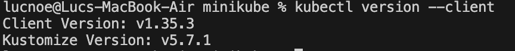
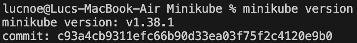
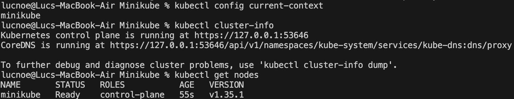
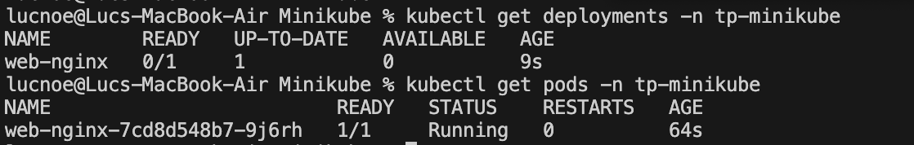
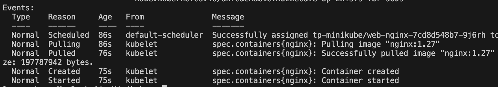
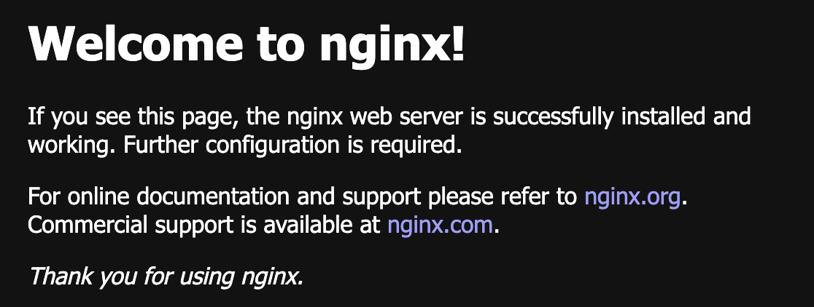
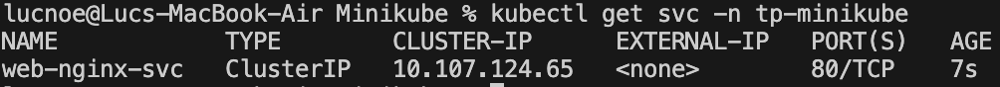
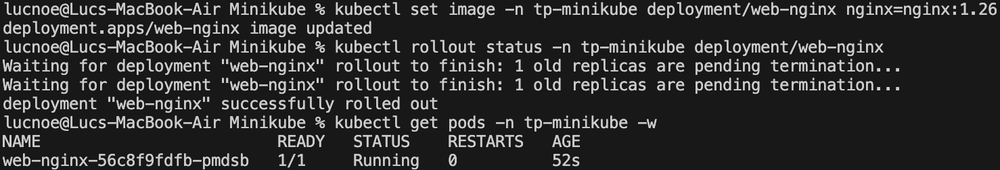

kubectl est bien installé sur le système d’exploitation

Minikube est bien installé sur le système d’exploitation

1. Quel est le nom du contexte courant (context) ?
minikube

2. Combien de nœuds voyez-vous ?
Un seul : minikube   Ready    control-plane   17m   v1.35.1

1. Quelle image exacte est utilisée ?
nginx:1.27

2. Quel évènement (Events) confirme le téléchargement et le démarrage ?
Container Created et started

Le pod est bien fonctionnel

Le service est bien exposé sur le port 80

Le conteneur est bien créé et démarré et le pod est bien assigné au node minikube

Le service est bien accessible :

1. À quoi sert un Service dans Kubernetes ?
Fournir une IP et un DNS stables pour accéder à des pods

2. Pourquoi le Service n'expose-t-il pas automatiquement une IP publique en local ?
Le cluster est dans un réseau Docker isolé, on ne peut pas le joindre depuis l'hôte.

1. Que se passe-t-il au niveau des pods lors d'un changement d'image ?
Kubernetes fait une RollingUpdate

2. Qu'est-ce qu'un "rollout" et pourquoi est-ce utile ?
C'est un déploiement progressif d'une nouvelle version, il est utile car il permet de restaurer une version précédente

