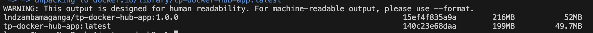
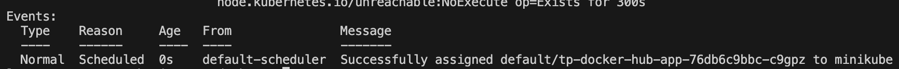

docker images | grep tp-docker-hub-app :

kubectl get pods -o wide

Accès web :

Optimisation :
Dans le dockerfile on a pris Alpine comme distribution pour réduire la taille de l'image, en mode production on ne copy que le nécessaire dans le deps pour que l'image final soit plus légère 

À quoi sert imagePullSecrets et comment vous l’avez configuré :
ImagePullSecrets sert à pull image privé, pour le configurer il faut créer un secret dans le dockerHub et le renseigné dans le deployment.yaml

